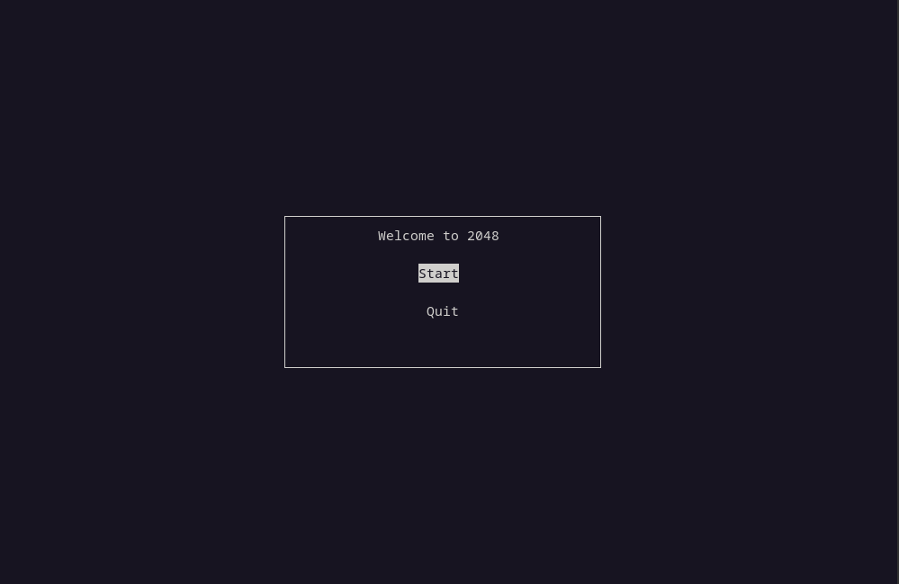
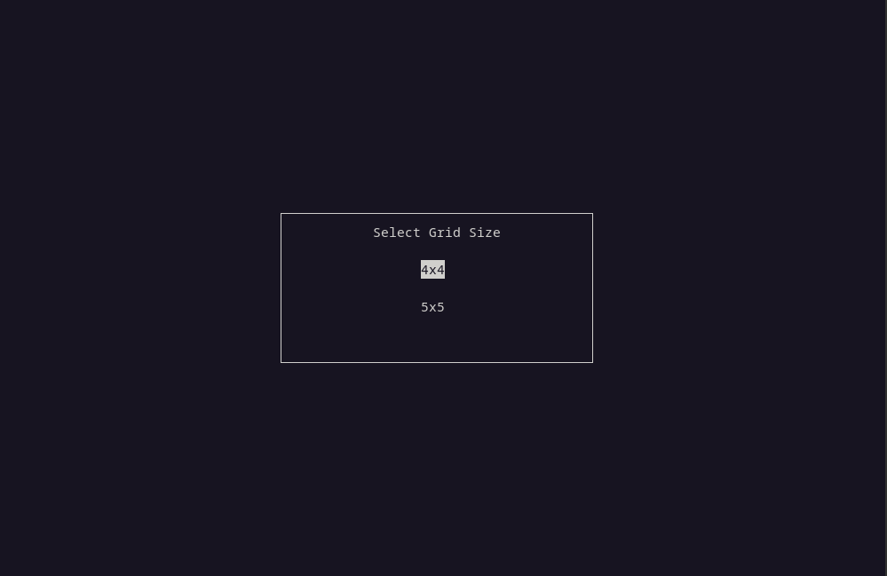
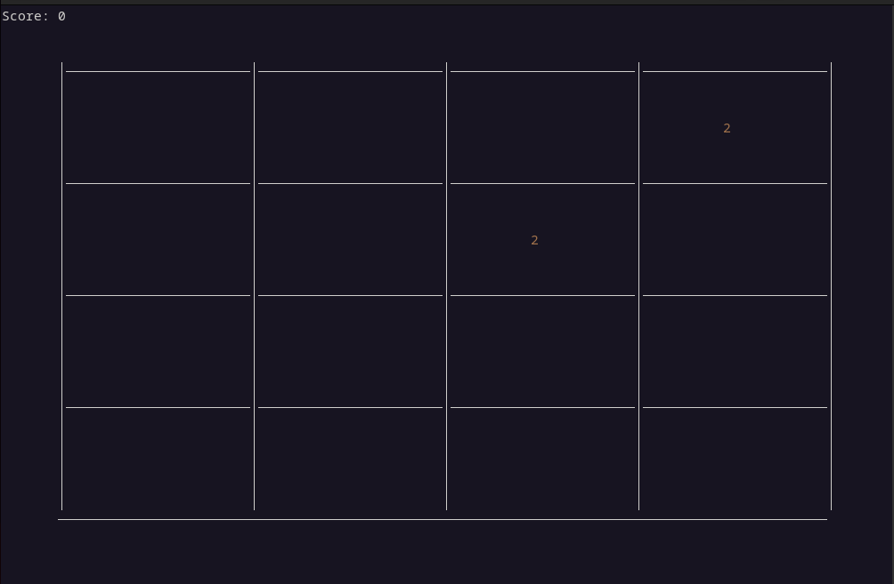
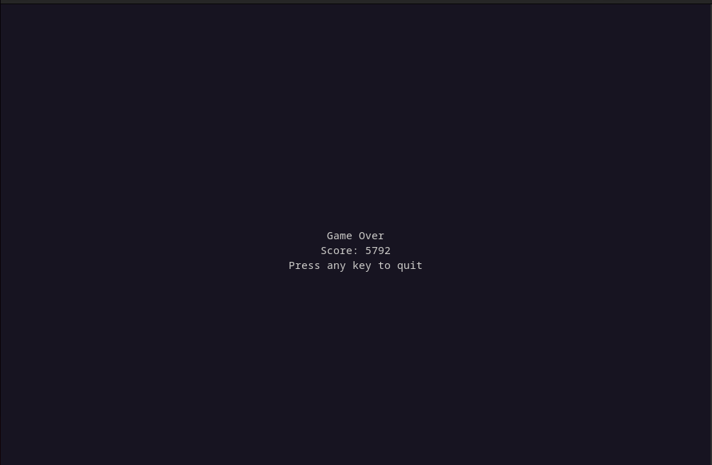

# Terminal 2048

A fully playable 2048 game inside your terminal, powered by the ncurses library. Enjoy a smooth and colorful game experience, complete with dynamic window resizing and support for both 4×4 and 5×5 grids.

## Features

* Classic 2048 gameplay in the terminal

* Choose between 4×4 or 5×5 grid

* Responsive UI with window resizing support

* Colored numbers using ncurses color pairs

* Lightweight and easy to build

## installation and usuage

### Dependencies

Before you begin, make sure the required ncurses development libraries are installed:
```bash
$ sudo apt-get install libncurses5-dev libncursesw5-dev
```
### Build & Run
```bash
# Clone the repo
$ git clone https://github.com/Abusalah0/2048.git

# enter the directory
$ cd 2048/

# build the game using make
$ make

# run it 
$ ./2048
```

### Gameplay

Choose your grid size, swipe tiles using arrow keys, and try to reach 2048! The game ends when there are no more valid moves.

### Start Menu


### Grid Selection


### First Tiles


### Game Over
